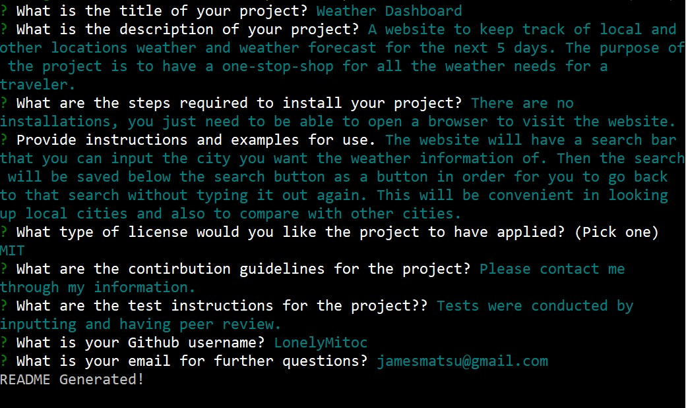
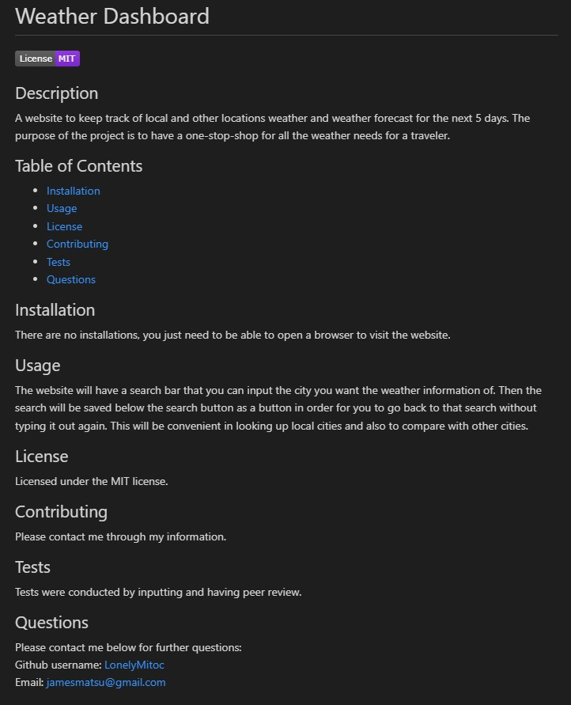

# README Generator for the busy programmer
  [](https://opensource.org/licenses/MIT)
  
  

## Description
Here we have a javascript program using node.js that will generate a professional looking README by simply running the program in the terminal and inputting everything you want to be shown in the README.

As stated above, we used node.js to use javascript outside of the browser and in our terminals.

The coding was straight-forward except for the new use of the back-hash that posed a small difficulty in using them in the correct context. In the future, I would like to implement more customization to the generated README (such as having code snippets, adding text colors, sourcing images of the project, having the option to choose the color of the license badge, option to add more sections with y/n prompts, add more badges such as technology, social media, blog, etc.).

## Table of Contents
- [Example](#example)
- [Installation](#installation)
- [Usage](#usage)
- [License](#license)
- [Contributing](#contributing)
- [Tests](#tests)
- [Questions](#questions)

## Example

[Demonstration](https://watch.screencastify.com/v/Wzef1bto8k3YBTBjlrpK)

Example of the input and the README that is generated:




## Installation

:warning: First, you will need to have installed the latest stable version of **node.js**.

Then, you will need to download this repository and go through the **npm initialization** (include "y" in order to skip through the prompts).

(do this if the **package.json** & **package.-lock.json** is not in the repository.)

```
npm init y
```

Then install the necessary **inquirer v8.2.4 package**.

```
npm install inquirer@8.2.4
```

Once the inquirer is installed and you see that the **package-lock.json** is in the folder, you can run the program by changing directory (cd) in the terminal to this program and run **node index.js**.

```
node index.js
```

Then answer all the prompts to generate a README!

## Usage
The program can be run in the terminal making it easy to access from your local device. With the user input, the program will automatically generate a README with all the basic topics covered for your project.

You will generate a title for your project, description, installation instructions, usage, license, how to contribute, tests and a questions sections to include your Github information (the Github information will automatically be linked) as well as your email. Additionally, the program will generate a badge for the license you select, with the appropriate link attached to the badge and each one has their own unique color.

If you choose not to have a license, we have the "n/a" option that will not generate a badge and show that there are no applicable license for the project in the license section.

Currently, the sections will be left blank if there is no input but in the future, we will omit the section if the input is blank.

## License
Licensed under the [MIT](https://opensource.org/licenses/MIT) license.

## Contributing
Contribution inquiries can be sent through the Github or the email in the question section (although, I work full time with family obligations so replies may be slow). I am open to all suggestions.

## Tests
Tests were only conducted through primitive trial and error with running the program over and over again with different variables and inputs.

## Credits
- [MDN Wed Docs](https://developer.mozilla.org/en-US/)
- [Stack Overflow](https://stackoverflow.com/)
- [Shields.io](https://shields.io/)
- [Github Gist: rxaviers](https://gist.github.com/rxaviers/7360908)

## Questions
Please contact me below for further questions:

:octocat: Github username: [LonelyMitoc](https://github.com/LonelyMitoc)

:e-mail: Email: jamesmatsu@gmail.com